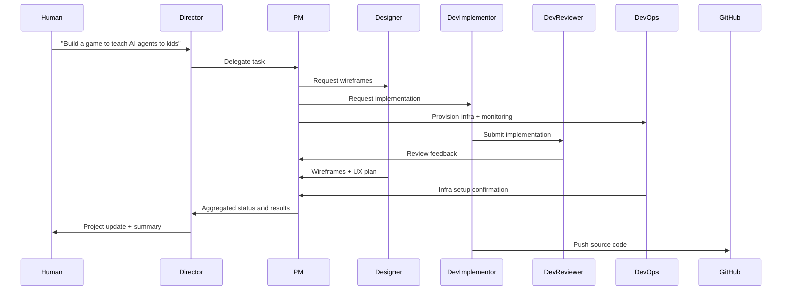

# Agent Workflow Sequence (Build a Game to Teach AI Agents to Kids)

```mermaid
sequenceDiagram
  participant Human
  participant Director
  participant PM
  participant Designer
  participant DevImplementor
  participant DevReviewer
  participant DevOps
  participant GitHub

  Human->>Director: "Build a game to teach AI agents to kids"
  Director->>PM: Delegate task
  PM->>Designer: Request wireframes
  PM->>DevImplementor: Request implementation
  PM->>DevOps: Provision infra + monitoring
  DevImplementor->>DevReviewer: Submit implementation
  DevReviewer->>PM: Review feedback
  Designer->>PM: Wireframes + UX plan
  DevOps->>PM: Infra setup confirmation
  PM->>Director: Aggregated status and results
  Director->>Human: Project update + summary
  DevImplementor->>GitHub: Push source code
```
